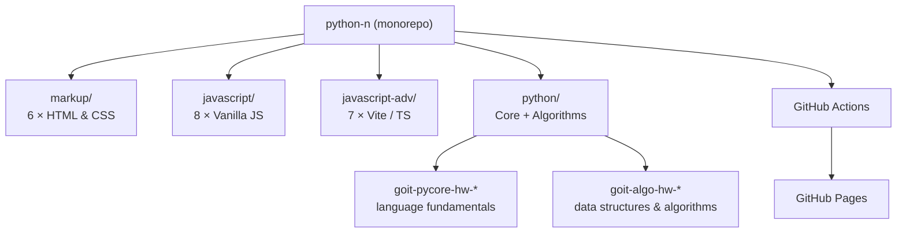
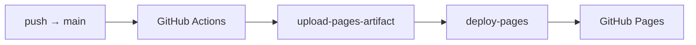

<div align="center">
  <h1>Neoversity · MSc Software Engineering & AI</h1>
  <p><strong>Academic repository for the MSc in Software Engineering & AI at Neoversity — coursework across Markup, JavaScript, Advanced JS/TypeScript, Python Core, and Algorithms.</strong></p>
</div>


## Table of Contents

- [Overview](#overview)
- [Tech Stack](#tech-stack)
- [Repository Map](#repository-map)
- [Project Structure](#project-structure)
- [Getting Started](#getting-started)
- [Running the Projects](#running-the-projects)
- [Tracks in Detail](#tracks-in-detail)
- [Deployment](#deployment)
- [License](#license)

## Overview

**What it is** — the academic repository for my **MSc in Software Engineering & AI**
at **Neoversity**. It collects the coursework completed throughout the program,
organized by discipline. Each track lives in its own top-level folder, and each
assignment (`*-hw-NN`) is a self-contained mini-project.

**Why it exists** — to keep degree coursework version-controlled, reviewable in one
place, and continuously deployable. The static front-end assignments are published
to GitHub Pages on every push to `main`.

**Status** — actively maintained throughout the degree. Four tracks are populated:
markup (6 assignments), vanilla JavaScript (8), advanced JS/TypeScript (7), and
Python Core + Algorithms (15 assignments combined).

## Tech Stack

| Track           | Technology                                                |
| --------------- | --------------------------------------------------------- |
| Markup          | HTML5, CSS3 (responsive layouts, BEM)                     |
| JavaScript      | Vanilla ES Modules, Prettier                              |
| Advanced JS     | Vite 5, SimpleLightbox, PostCSS, vite-plugin-html-inject  |
| TypeScript      | TypeScript 5 (`goit-advancedjs-hw-07`)                    |
| Python Core     | Python 3.12+ (REPL bots, address book, generators)        |
| Algorithms      | Python 3.12+ (graphs, DP, greedy, recursion, Monte Carlo) |
| CI/CD           | GitHub Actions → GitHub Pages                             |
| Package Manager | npm (per advanced-JS assignment)                          |

## Repository Map



## Project Structure

```
.
├── markup/                  # HTML/CSS coursework (static sites)
│   └── goit-markup-hw-01..06   # progressive landing-page builds
├── javascript/              # Vanilla JS fundamentals
│   └── goit-js-hw-01..08       # DOM, events, forms, timers
├── javascript-adv/          # Modern tooling track
│   ├── goit-advancedjs-hw-01..06  # Vite apps (galleries, APIs, libraries)
│   └── goit-advancedjs-hw-07      # TypeScript module
├── python/                  # Python coursework
│   ├── goit-pycore-hw-03..08   # core language: REPL bots, address book
│   └── goit-algo-hw-02..10     # algorithms: graphs, DP, recursion
└── .github/workflows/
    └── static.yml           # Deploy static content to GitHub Pages
```

> Each assignment folder is independent and carries its own `README.md`,
> dependencies, and (where applicable) build config.

## Getting Started

### Prerequisites

- **Node.js** >= 18.x — for the JavaScript and advanced-JS tracks
- **npm** >= 9.x
- **Python** >= 3.12 — for the Python Core and Algorithms tracks
- A modern browser — for the markup and vanilla-JS assignments (open `index.html`)

### Clone

```bash
git clone git@github.com:ErikKopcha/python-n.git
cd python-n
```

## Running the Projects

### Markup (`markup/goit-markup-hw-*`)

Static HTML/CSS — open the file directly in a browser:

```bash
open markup/goit-markup-hw-06/index.html
```

### Vanilla JavaScript (`javascript/goit-js-hw-*`)

ES-module pages — open `index.html` (use a local server if modules are blocked by `file://`):

```bash
npx serve javascript/goit-js-hw-05
```

### Advanced JavaScript (`javascript-adv/goit-advancedjs-hw-*`)

Vite-based projects — install and run per assignment:

```bash
cd javascript-adv/goit-advancedjs-hw-01
npm install
npm run dev        # start dev server
npm run build      # production build
npm run preview    # preview the build
```

> `goit-advancedjs-hw-03` and `hw-04` read configuration from `.env` —
> copy `.env.example` to `.env` and fill in the required keys before running.

### Python Core & Algorithms (`python/`)

Standalone scripts — run directly with Python 3.12+:

```bash
cd python/goit-algo-hw-09
python3 main.py

# Algorithm benchmarks / tests where provided
python3 benchmark.py
python3 test_examples.py
```

## Tracks in Detail

| Track           | Assignments | Focus                                                            |
| --------------- | ----------- | ---------------------------------------------------------------- |
| **Markup**      | 6           | Semantic HTML, responsive CSS, progressive landing-page builds   |
| **JavaScript**  | 8           | DOM manipulation, events, forms, timers, ES modules              |
| **Advanced JS** | 7           | Vite tooling, third-party libraries, HTTP APIs, TypeScript       |
| **Python Core** | 6           | REPL assistant bots, address book, generators, decorators        |
| **Algorithms**  | 9           | Graphs (BFS/DFS, Dijkstra), greedy vs DP, recursion, Monte Carlo |

Highlights from the Algorithms track:

- **hw-06** — Kyiv Metro graph model with BFS/DFS traversal and Dijkstra shortest paths
- **hw-08** — cable-connection (greedy) and merge-k-sorted-lists problems
- **hw-09** — coin change: greedy vs dynamic programming, with benchmarks
- **hw-10** — linear-programming production planning and Monte Carlo simulation

## Deployment

Static content is deployed automatically to **GitHub Pages** via
[`.github/workflows/static.yml`](.github/workflows/static.yml) on every push to `main`:



## License

Private — academic coursework for the MSc in Software Engineering & AI at Neoversity.
All rights reserved © 2026 Erik Kopcha.
