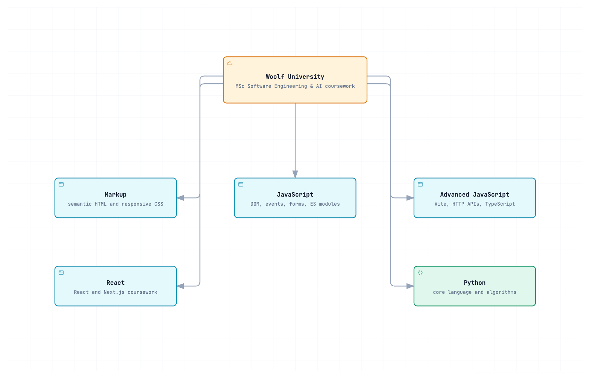

<div align="center">
  <h1>Woolf University · MSc Software Engineering & AI</h1>
  <p><strong>Coursework monorepo for the MSc in Software Engineering & AI at Woolf University.</strong></p>
</div>


## Overview

This repository keeps Woolf University coursework organized by discipline. Each assignment is an independently runnable project, so coursework can be reviewed without imposing a root workspace, shared dependency graph, or common runtime.

The repository covers progressive front-end work from semantic HTML and browser JavaScript to React and Next.js, plus Python Core and algorithms. **RentalCar** is the current featured project: a production-style Next.js frontend for a public car-rental API.

## Tech Stack

| Track             | Focus                                  | Primary tools                        |
| ----------------- | -------------------------------------- | ------------------------------------ |
| `markup/`         | Semantic, responsive static pages      | HTML5, CSS3, BEM                     |
| `javascript/`     | Browser and ES module fundamentals     | JavaScript, DOM APIs                 |
| `javascript-adv/` | Modern frontend tooling and TypeScript | Vite, PostCSS, TypeScript            |
| `react/`          | React and Next.js applications         | React 19, Next.js 16, TanStack Query |
| `python/`         | Language fundamentals and algorithms   | Python 3.12+, graphs, DP, recursion  |

## Architecture

The monorepo is intentionally a collection of isolated projects, not a deployable application. Each track owns its dependencies and entry points; the root README provides navigation and consistent run instructions.
[](docs/diagrams/repository-landscape.html)

- [Open the repository landscape](docs/diagrams/repository-landscape.html) — interactive architecture map with light/dark themes and PNG export.

## Project Structure

```text
.
├── markup/                         # progressive HTML/CSS assignments
│   └── goit-markup-hw-01..06/
├── javascript/                     # browser JavaScript assignments
│   └── goit-js-hw-01..08/
├── javascript-adv/                 # Vite, APIs, libraries, TypeScript
│   └── goit-advancedjs-hw-01..07/
├── react/                          # React and Next.js coursework
│   ├── 02-cafe/ .. 08-zustand/     # course modules
│   └── rental-car/                 # featured Next.js application
├── python/                         # Python Core and Algorithms
│   ├── goit-pycore-hw-*/
│   └── goit-algo-hw-*/
└── docs/
    └── diagrams/                   # interactive repository diagrams
```

## Getting Started

### Prerequisites

- **Node.js** — version required by each JavaScript project; RentalCar requires **Node.js 22**.
- **npm** — used by most Vite-based assignments.
- **pnpm 11** — required by RentalCar (`react/rental-car/.nvmrc` pins Node.js 22).
- **Python 3.12+** — Python Core and Algorithms assignments.

### Clone

```bash
git clone git@github.com:ErikKopcha/python-n.git
cd python-n
```

## Running Projects

Run every project from its own directory. Dependencies and scripts are local to that project.

### Markup

```bash
open markup/goit-markup-hw-06/index.html
```

### Vanilla JavaScript

```bash
npx serve javascript/goit-js-hw-05
```

### Advanced JavaScript

```bash
cd javascript-adv/goit-advancedjs-hw-01
npm install
npm run dev
```

Some advanced assignments require a local `.env`; copy their `.env.example` before starting the project.

### React / Next.js — RentalCar

```bash
cd react/rental-car
pnpm install
cp .env.example .env.local
pnpm dev
```

Open [http://localhost:3000](http://localhost:3000). The checked-in defaults target the public Rental Car API; both environment variables are optional for local development.

| Command             | Purpose                               |
| ------------------- | ------------------------------------- |
| `pnpm dev`          | Start Next.js development server      |
| `pnpm build`        | Build production output               |
| `pnpm start`        | Run production server                 |
| `pnpm lint`         | Run ESLint                            |
| `pnpm typecheck`    | Run TypeScript without emitting files |
| `pnpm test`         | Run Vitest                            |
| `pnpm format:check` | Check Prettier formatting             |

### Python Core and Algorithms

```bash
cd python/goit-algo-hw-09
python3 main.py
```

Individual assignments may include their own examples, benchmarks, or tests. Consult the assignment directory before running optional scripts.

## License

Private — academic coursework for the MSc in Software Engineering & AI at Woolf University. All rights reserved © 2026 Erik Kopcha.
