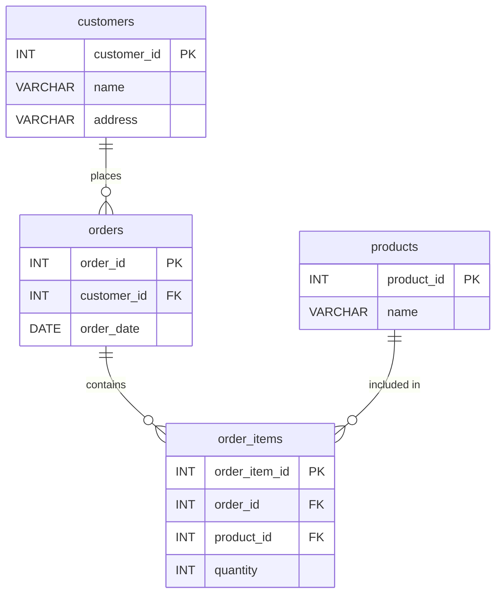

<div align="center">
  <h1>goit-rdb-hw-02</h1>
  <p><strong>Normalize a denormalized orders table through 1NF → 2NF → 3NF, model it as an ER diagram, and implement the schema in MySQL.</strong></p>
</div>


## Overview

This project is Homework 2 for the **Relational Databases** course (GoIT Neoversity, Master's programme). It demonstrates a full normalization workflow starting from a single denormalized table that violates 1NF, 2NF, and 3NF — and ending with four properly structured tables connected via foreign keys.

The original table stores order data with multi-valued cells, duplicated client info, and transitive dependencies. Each normalization stage isolates and resolves one class of violations, producing a clean relational schema.

## Tech Stack

| Layer     | Technology               |
|-----------|--------------------------|
| Database  | MySQL 8.0 (InnoDB)       |
| Container | Docker Compose           |
| ER Diagram| draw.io (diagrams.net)   |
| IDE       | WebStorm (Database Tools)|

## Architecture



**Relationships:**

- `customers` 1 → N `orders` — one customer places many orders
- `orders` 1 → N `order_items` — one order contains many line items
- `products` 1 → N `order_items` — one product appears in many line items

## Project Structure

```
├── p1_1nf.md              # Stage 1: First Normal Form — atomic values
├── p2_2nf.md              # Stage 2: Second Normal Form — no partial dependencies
├── p3_3nf.md              # Stage 3: Third Normal Form — no transitive dependencies
├── p4_er_diagram.drawio   # Stage 4: ER Diagram (open with draw.io)
├── p5_create_tables.sql   # Stage 5: SQL DDL — CREATE TABLE statements
├── docker-compose.yml     # MySQL 8 container with auto-init
├── screenshots/           # Screenshots for each homework stage
│   ├── p4_er_diagram.drawio.png
│   └── p5_schema.png
└── README.md
```

## Getting Started

### Prerequisites

- **Docker** >= 20.x with Compose V2
- **draw.io** — [app.diagrams.net](https://app.diagrams.net/) (web, no install)
- **WebStorm** or any MySQL client for schema inspection

### Running the Database

```bash
# Start MySQL container (tables auto-created on first run)
docker compose up -d

# Verify tables were created
docker exec -it goit-rdb-hw-02-mysql mysql -uroot -proot -e "USE goit_rdb_hw_02; SHOW TABLES;"

# Stop and remove container
docker compose down
```

### Connecting from WebStorm

1. **View → Tool Windows → Database**
2. **+ → Data Source → MySQL**
3. Fill in connection details:

| Parameter | Value            |
|-----------|------------------|
| Host      | `localhost`      |
| Port      | `3306`           |
| User      | `root`           |
| Password  | `root`           |
| Database  | `goit_rdb_hw_02` |

4. **Test Connection → OK**

### Viewing the ER Diagram

1. Open [app.diagrams.net](https://app.diagrams.net/)
2. **File → Open from → Device** → select `p4_er_diagram.drawio`

## Source Data

The original denormalized table used as input for normalization:

| Номер_замовлення | Назва_товару і кількість | Адреса_клієнта | Дата_замовлення | Клієнт    |
|---|---|---|---|---|
| 101 | Лептоп: 3, Мишка: 2 | Хрещатик 1    | 2023-03-15 | Мельник   |
| 102 | Принтер: 1           | Басейна 2     | 2023-03-16 | Шевченко  |
| 103 | Мишка: 4             | Комп'ютерна 3 | 2023-03-17 | Коваленко |

**Violations found:** multi-valued cells (1NF), partial dependencies (2NF), transitive dependencies (3NF).

## License

Private — all rights reserved.
