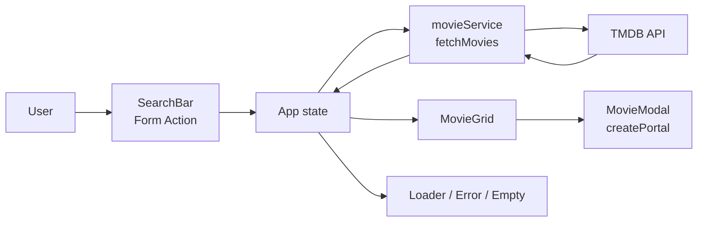
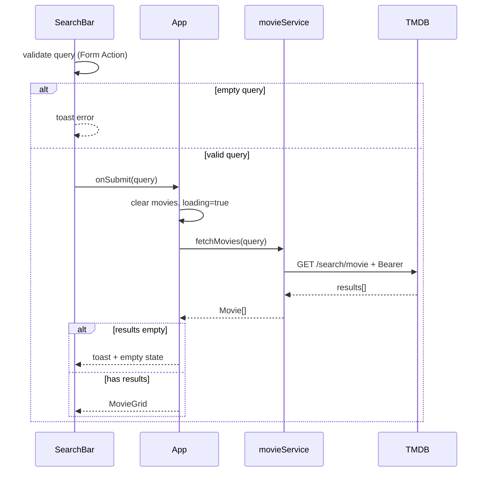

<div align="center">
  <h1>CineScope</h1>
  <p><strong>Search TMDB movies in a typed React SPA with modal details and a cinematic UI.</strong></p>
</div>


## Overview

**What it does** — CineScope is a single-page React application for keyword search across The Movie Database (TMDB). Users submit a query, browse poster cards, and open a modal with backdrop, overview, release date, and rating.

**Why it exists** — Built as GoIT React homework `03-react-movies` to practice HTTP with Axios, component state, Form Actions, portals, CSS Modules, and TypeScript typing against a real API.

**Current status** — Feature-complete MVP for course acceptance criteria, with a premium dark cinematic UI layer (Fraunces + Manrope, glass search shell, themed toasts, empty states). Ready for local run and Vercel deploy once `VITE_TMDB_TOKEN` is set.

## Tech Stack

| Layer         | Technology                                      |
| ------------- | ----------------------------------------------- |
| Build         | Vite 8.2                                        |
| UI            | React 19.2, React DOM 19.2                      |
| Language      | TypeScript 6.0 (strict)                         |
| HTTP          | Axios 1.19                                      |
| Notifications | react-hot-toast 2.6                             |
| Styling       | CSS Modules, modern-normalize 3.0               |
| Quality       | Prettier 3.6, Oxlint 1.75                       |
| API           | [TMDB](https://www.themoviedb.org/) REST API v3 |

Shared domain types live in `src/types/`; HTTP stays in `src/services/`; presentational components own only UI and callbacks.

## Architecture

`App` owns search orchestration (`movies`, loading, error, selected movie). `SearchBar` validates empty input via Form Actions and toasts. Successful queries call `fetchMovies` (Axios + Bearer token). Results render in `MovieGrid`; selection opens `MovieModal` through `createPortal` with Escape / backdrop / close-button dismissal and body scroll lock. Image URLs are built in `utils/imageUrl` with a local poster fallback.

### System Overview



### Search Flow



## Project Structure

```text
src/
├── components/
│   ├── App/              # State orchestration, hero / empty states, Toaster
│   ├── SearchBar/        # Header + Form Action search
│   ├── MovieGrid/        # Poster card gallery
│   ├── MovieModal/       # Portal modal with details
│   ├── Loader/           # Loading indicator
│   └── ErrorMessage/     # HTTP error message
├── services/
│   └── movieService.ts   # Axios TMDB search
├── types/
│   └── movie.ts          # Shared Movie interface
├── utils/
│   └── imageUrl.ts       # Poster / backdrop URL builders
├── index.css             # Tokens, normalize, toast theme
├── main.tsx              # React root
└── vite-env.d.ts         # ImportMetaEnv for VITE_TMDB_TOKEN
public/
├── favicon.svg
└── no-poster.svg         # Fallback when poster_path is missing
```

## Getting Started

### Prerequisites

- **Node.js** >= 20.x
- **npm** >= 10.x
- **TMDB account** with a Read Access Token (v4 auth)

### Installation

```bash
git clone git@github.com:deluminor/03-react-movies.git
cd 03-react-movies
npm install
```

### Environment Setup

```bash
cp .env.example .env
```

| Variable          | Description                                     | Required |
| ----------------- | ----------------------------------------------- | -------- |
| `VITE_TMDB_TOKEN` | TMDB Read Access Token (`Bearer` Authorization) | ✅       |

> Get the token in TMDB → Settings → API → API Read Access Token. Never commit `.env`.

## Running the App

```bash
npm run dev
```

Open [http://localhost:5173](http://localhost:5173).

```bash
npm run build
npm run preview
```

## Available Scripts

| Script                 | Description                             |
| ---------------------- | --------------------------------------- |
| `npm run dev`          | Start Vite dev server                   |
| `npm run build`        | Typecheck (`tsc -b`) + production build |
| `npm run preview`      | Preview production build locally        |
| `npm run typecheck`    | TypeScript project references check     |
| `npm run lint`         | Oxlint                                  |
| `npm run format`       | Prettier write                          |
| `npm run format:check` | Prettier check                          |

## Key Features

- Keyword movie search against TMDB with Axios Bearer auth
- Form Actions validation and themed react-hot-toast notifications
- Responsive poster grid with lazy-loaded images and fallback art
- Modal details via `createPortal` (Escape, backdrop click, scroll lock + cleanup)
- Loading, error, idle hero, and empty-result states
- CSS Modules cinematic UI (dark ink + champagne accent)

## Deployment

Deploy on [Vercel](https://vercel.com):

1. Import `deluminor/03-react-movies`
2. Framework preset: **Vite**
3. Add environment variable `VITE_TMDB_TOKEN`
4. Deploy — Vite defaults (`npm run build`, output `dist`)

After pushing updates, wait a few minutes before submitting course links so GitHub/Vercel can refresh.

## License

Private — all rights reserved.
