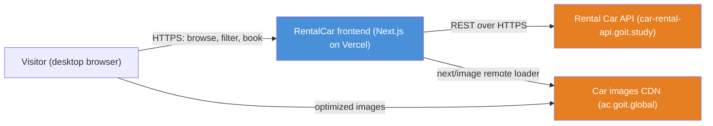
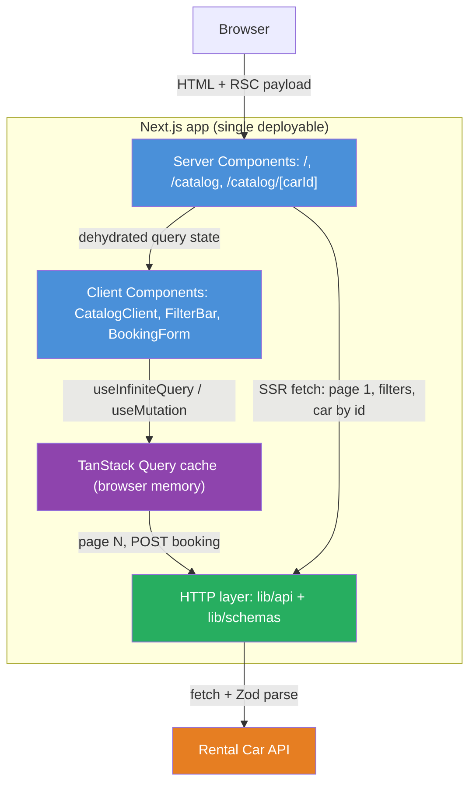
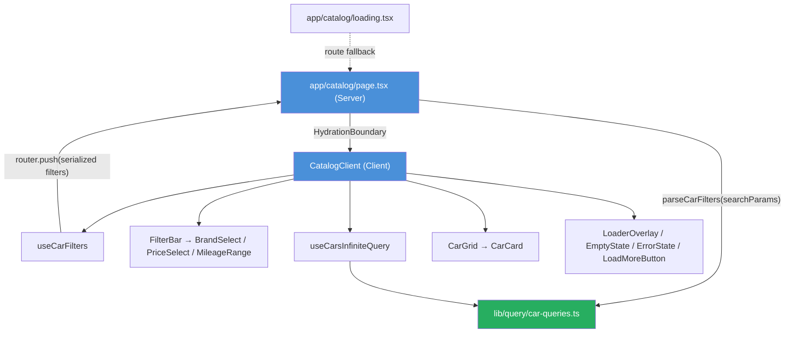
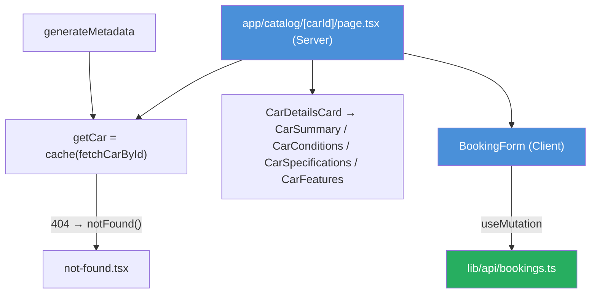
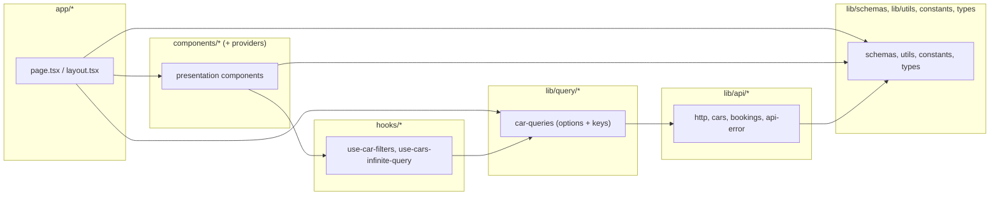
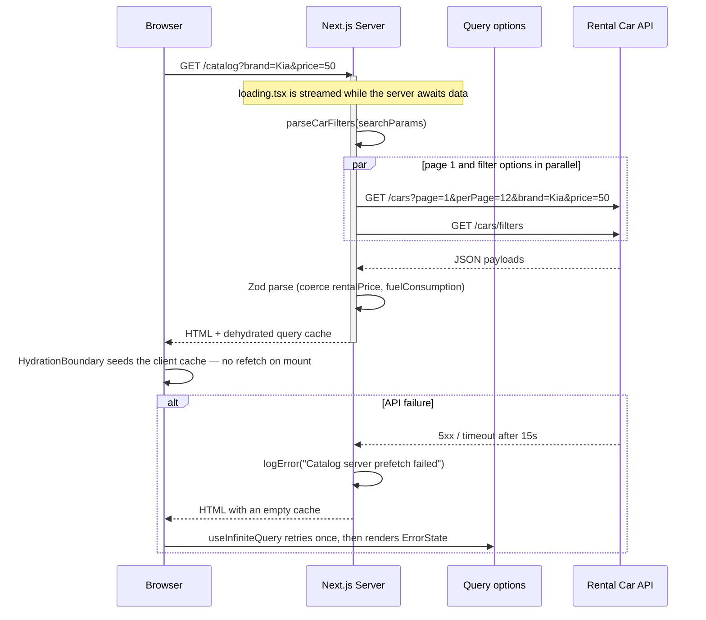
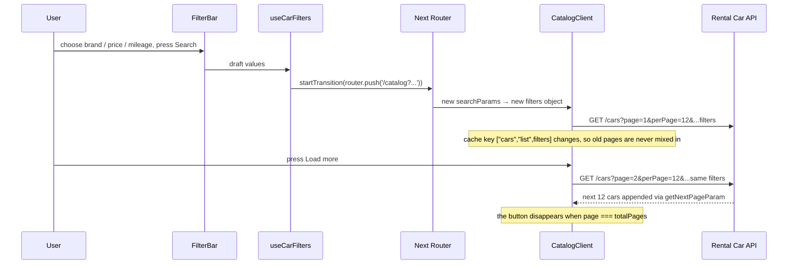
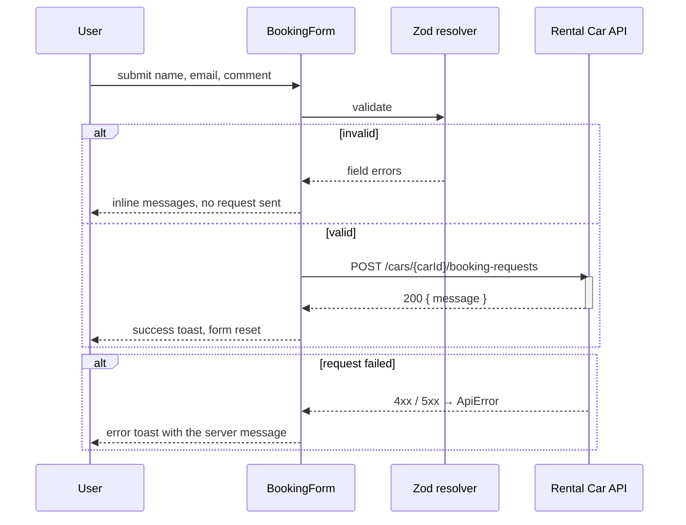
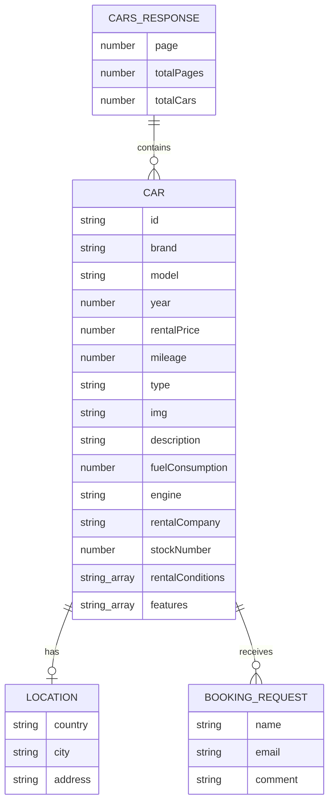

# RentalCar — Architecture

> Interactive version of the container diagram: [`docs/architecture/rental-car-architecture.html`](docs/architecture/rental-car-architecture.html)

## 1. Project Snapshot

**RentalCar** is the frontend of a car-rental service. It renders three routes — a marketing home page, a
filterable car catalog with `Load more` pagination, and a car-details page with a booking form — on top of the
public **Rental Car API**. There is no own backend, no database and no authentication: the Next.js server acts
purely as a rendering and data-prefetch layer in front of a third-party REST API.

| Property       | Value                                                                                |
| -------------- | ------------------------------------------------------------------------------------ |
| Status         | Feature-complete for the specified scope                                             |
| Rendering      | Server Components by default, Client Components only where interaction requires them |
| Persistence    | None (stateless); filter state lives in the URL, response cache in TanStack Query    |
| Runtime target | Vercel (Node.js 22)                                                                  |

## 2. Stack & Runtime

| Area          | Choice                                                         | Where                                          |
| ------------- | -------------------------------------------------------------- | ---------------------------------------------- |
| Framework     | Next.js 16 App Router, React 19                                | `app/`                                         |
| Language      | TypeScript 5, `strict` + `noUncheckedIndexedAccess`            | `tsconfig.json`                                |
| Server data   | `queryClient.infiniteQuery` / `query` + `dehydrate`            | `app/catalog/page.tsx`                         |
| Client data   | TanStack Query 5 `useInfiniteQuery`, `useQuery`, `useMutation` | `hooks/`, `components/BookingForm`             |
| HTTP          | native `fetch` wrapper with timeout and typed `ApiError`       | `lib/api/http.ts`                              |
| Validation    | Zod 4 for API responses and the booking form                   | `lib/schemas/`                                 |
| Forms         | react-hook-form + `@hookform/resolvers/zod`                    | `components/BookingForm/BookingForm.tsx`       |
| Styling       | CSS Modules + design tokens in `:root`                         | `app/globals.css`                              |
| Icons         | `react-icons` (Feather, Bootstrap, Tabler sets)                | `components/CarDetails/*`, `components/Select` |
| Notifications | react-hot-toast                                                | `providers/ToastProvider.tsx`                  |
| Tooling       | pnpm, ESLint (`eslint-config-next`), Prettier, Vitest          | `package.json`                                 |

## 3. C4 Level 1 — System Context



## 4. C4 Level 2 — Container Diagram



## 5. C4 Level 3 — Component Diagrams

### 5.1 Catalog slice



### 5.2 Car-details slice



## 6. Source Tree Map

```plaintext
app/                          # App Router: routes, metadata, error and loading boundaries
├── catalog/                  # /catalog — server page, client shell, loading + error boundary
│   └── [carId]/              # /catalog/[carId] — server page, loading, error, not-found
├── globals.css               # design tokens (:root) + minimal reset
├── layout.tsx                # root layout: font, metadata, providers, header
├── robots.ts, sitemap.ts     # generated /robots.txt and /sitemap.xml
components/                   # presentation only; one folder per component + CSS module
├── BookingForm/              # the single form of the app (client)
├── CarCard/, CarGrid/        # catalog list rendering
├── CarDetails/               # details card split by section
├── FilterBar/                # brand select, price select, mileage range
├── Loader/                   # spinner, in-flow panel, blocking overlay
└── Select/, TextField/       # reusable controls (custom listbox, input, textarea)
constants/                    # API endpoints, routes, pagination, filter params, assets, copy
hooks/                        # use-car-filters, use-cars-infinite-query, use-car-filter-options, use-outside-click
lib/
├── api/                      # http wrapper, cars, bookings, ApiError
├── query/                    # QueryClient factory + shared query options and keys
├── schemas/                  # Zod schemas (cars, filter options, booking)
├── utils/                    # pure helpers: formatting, filter parse/serialize, query building
├── env.ts, site-url.ts       # validated public env values
└── logger.ts                 # error logging that stays silent in a production browser
providers/                    # QueryProvider, ToastProvider (client)
types/                        # types inferred from Zod schemas + filter types
docs/architecture/            # interactive architecture diagram (standalone HTML)
```

## 7. Module Dependency Graph

Arrow direction is **importer → dependency**. Nothing points backwards: components never import routes,
`lib/api` never imports React.



## 8. Critical Runtime Flows

### 8.1 First catalog request with filters in the URL



### 8.2 Filtering and `Load more`



### 8.3 Booking request



## 9. Data Model Overview

Domain types are **inferred from Zod schemas**, so a schema change cannot drift from the type.



| Filter type       | Shape                                          | Purpose                                                  |
| ----------------- | ---------------------------------------------- | -------------------------------------------------------- |
| `CarFilters`      | `{ brand?, price?, minMileage?, maxMileage? }` | applied filters, part of the query key and the API query |
| `CarFiltersDraft` | all fields `string`                            | in-progress form values before `Search` is pressed       |

## 10. Cross-Cutting Concerns

| Concern              | Implementation                                                                                                                                                                         |
| -------------------- | -------------------------------------------------------------------------------------------------------------------------------------------------------------------------------------- |
| **Error taxonomy**   | `ApiError(status, message)` for anything the API rejected; everything else is an unexpected error mapped to one generic user message (`lib/api/api-error.ts`)                          |
| **Error boundaries** | `app/error.tsx`, `app/catalog/error.tsx`, `app/catalog/[carId]/error.tsx`, plus `app/global-error.tsx`; `notFound()` renders a route-specific 404 with the real HTTP status            |
| **Loading states**   | route level `loading.tsx` for both catalog routes, `LoaderOverlay` for filter transitions and refetches, spinner inside `Load more` and `Send` buttons                                 |
| **Empty state**      | `EmptyState` with a reset action when a filter combination returns no cars                                                                                                             |
| **Logging**          | `lib/logger.ts` — server always logs, a production browser console stays clean because every failure already has UI feedback                                                           |
| **Caching**          | `staleTime` 60s, `gcTime` 5min; filter options cached forever (`staleTime: Infinity`); pages keyed by `["cars","list",filters]`, so changing a filter starts a fresh, independent list |
| **Cancellation**     | every request receives the query `signal`; `lib/api/http.ts` combines it with a 15s `AbortSignal.timeout`                                                                              |
| **Validation**       | Zod at both trust boundaries: API responses (`parseResponse`) and user input (`BookingFormSchema`)                                                                                     |
| **Filter state**     | URL search params are the single source of truth, so any result set is shareable, reload-safe and server-renderable                                                                    |
| **Styling system**   | CSS Modules only; colors, radii, container width and font live as tokens in `app/globals.css`; no inline styles                                                                        |
| **Accessibility**    | one `h1` per page, custom select implements the ARIA select-only combobox pattern, mileage inputs grouped in a `fieldset`/`legend`, `aria-busy` on pending buttons, visible focus ring |
| **SEO / head**       | `metadataBase`, title template, Open Graph, canonical URLs, `generateMetadata` per car, `robots.ts`, `sitemap.ts`                                                                      |

## 11. External Integrations

| Integration                        | Purpose                                        | Auth | Contract                                                                                                                                        |
| ---------------------------------- | ---------------------------------------------- | ---- | ----------------------------------------------------------------------------------------------------------------------------------------------- |
| `GET /cars`                        | catalog list, backend filtering and pagination | none | query: `page`, `perPage` (max 12), `brand`, `price` (upper bound), `minMileage`, `maxMileage`; response `{ cars, totalCars, page, totalPages }` |
| `GET /cars/filters`                | brand list and price range for the filter bar  | none | `{ brands: string[], price: { min, max } }`                                                                                                     |
| `GET /cars/{id}`                   | full car for the details page                  | none | single `Car`; `404` → `notFound()`                                                                                                              |
| `POST /cars/{id}/booking-requests` | booking submission                             | none | body `{ name, email, comment }`; response `{ message? }`                                                                                        |
| `ac.goit.global`                   | car photos                                     | none | allow-listed in `next.config.ts` `images.remotePatterns`                                                                                        |

Known API quirks handled in code: `perPage > 12` returns `400`; `rentalPrice` arrives as a string and
`fuelConsumption` may be a string, both coerced by Zod; `stockNumber` is the value shown as `Article`.

## 12. Environment & Config

| Variable                   | Type         | Default                                                       | Sensitivity                                                 |
| -------------------------- | ------------ | ------------------------------------------------------------- | ----------------------------------------------------------- |
| `NEXT_PUBLIC_API_BASE_URL` | absolute URL | `https://car-rental-api.goit.study`                           | public, validated at import time (`lib/env.ts`)             |
| `SITE_URL`                 | absolute URL | `VERCEL_PROJECT_PRODUCTION_URL`, else `http://localhost:3000` | server-side only, used for canonical / Open Graph / sitemap |

Both values are parsed with Zod; a malformed URL fails the build instead of producing broken links. No secret
is required by the app.

## 13. ADR Log

### ADR-001 — URL search params as the single source of filter state

**Date:** 2026-09-08
**Status:** Accepted

**Context:** filters must be applied on the backend, survive a reload, and be prefetchable on the server.

**Decision:** `CatalogClient` writes filters into the URL (`router.push` inside `startTransition`); the server
page parses them back into a `CarFilters` object which feeds both the query key and the API request.

**Consequences:** shareable and reload-safe result sets, no duplicated client state, server-rendered first
paint for any filter combination. Cost: every `Search` is a navigation, so a pending transition state is
needed (`isPendingNav`).

### ADR-002 — Query options declared once, used by server and client

**Date:** 2026-09-08
**Status:** Accepted

**Context:** the same list query runs on the server (prefetch) and in the browser (`useInfiniteQuery`). Two
declarations would eventually drift and break hydration.

**Decision:** `lib/query/car-queries.ts` exports `infiniteQueryOptions` / `queryOptions` factories plus the
`carsKeys` key map; both sides import them.

**Consequences:** key and `queryFn` can never diverge, so hydration always hits the same cache entry.

### ADR-003 — Zod at both trust boundaries, types inferred from schemas

**Date:** 2026-09-08
**Status:** Accepted

**Context:** the API returns numeric fields as strings and marks several fields optional; hand-written
interfaces would silently lie about the payload.

**Decision:** every response passes through `parseResponse(schema, data)`; domain types are `z.infer` of the
schemas; the booking form shares its schema with the resolver.

**Consequences:** one place to fix a contract change, no `any`, an unexpected payload becomes a typed
`ApiError(502)` instead of a render crash. Cost: a small runtime parse per response.

### ADR-004 — Custom `Select` instead of a headless UI dependency

**Date:** 2026-09-09
**Status:** Accepted

**Context:** the mockup requires a styled dropdown with a custom trigger label (`To $40`) that a native
`<select>` cannot render.

**Decision:** a local `Select` implementing the ARIA select-only combobox pattern (keyboard, outside click,
`aria-activedescendant`), reused by brand and price filters.

**Consequences:** no extra dependency and full visual control; the pattern must be maintained by hand, which is
why the component stays small and is the only custom widget in the project.

### ADR-005 — CSS Modules instead of a utility framework

**Date:** 2026-09-08
**Status:** Accepted

**Context:** the design is a fixed desktop mockup with a small, repeated token set.

**Decision:** CSS Modules per component plus tokens in `:root`.

**Consequences:** styles stay next to their component, class names cannot leak, no build-time plugin. Cost: no
utility shorthands, so shared values must be tokens.

## 14. Known Gaps & Roadmap

| Gap                                                         | Why it is acceptable now                                                                                                | Next step                                                       |
| ----------------------------------------------------------- | ----------------------------------------------------------------------------------------------------------------------- | --------------------------------------------------------------- |
| Responsiveness is partial (desktop is the specified target) | the task requires only the desktop layout                                                                               | add breakpoints for the filter bar and details grid below 768px |
| No E2E tests                                                | flows were verified manually in a real browser; unit tests cover filter parsing, query building, formatting and schemas | add a Playwright smoke test for filter → `Load more` → booking  |
| Booking response is not persisted anywhere                  | the API returns only a message; there is no order history endpoint                                                      | show a booking summary page if the API ever exposes one         |
| No i18n                                                     | single-language mockup                                                                                                  | extract copy if a second locale is required                     |
