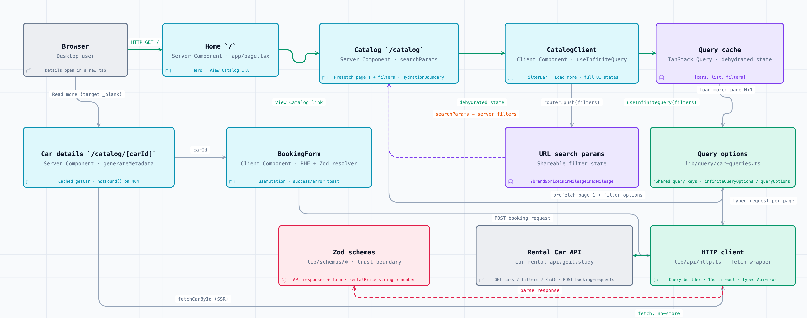

# RentalCar

Frontend for **RentalCar**, a car-rental company: browse available cars, filter them **on the backend** by
brand, price per hour and mileage, load more results page by page, open a car in a new tab and send a booking
request.

Built with **Next.js 16 (App Router)** and **TypeScript** on top of the public
[Rental Car API](https://car-rental-api.goit.study/api-docs).


## Live demo

- **Production:** https://rental-car-five-rho.vercel.app
- **API docs:** https://car-rental-api.goit.study/api-docs

## Architecture at a glance



**Interactive diagram:** [`docs/architecture/rental-car-architecture.html`](docs/architecture/rental-car-architecture.html)
— open it in a browser to explore components, relationships, light/dark themes and export the picture.
Full technical description: [`ARCHITECTURE.md`](ARCHITECTURE.md).

## Pages

| Route              | Rendering                  | Description                                                                         |
| ------------------ | -------------------------- | ----------------------------------------------------------------------------------- |
| `/`                | Server Component           | Hero section with the main call to action (`View Catalog`)                          |
| `/catalog`         | Server page + client shell | Car list, backend filtering, `Load more` pagination, loading / empty / error states |
| `/catalog/[carId]` | Server Component           | Car photo, full specification, rental conditions, features and the booking form     |

## Features

- **Backend filtering** — brand (single choice), price per hour (an upper bound, rendered as `To $40`) and a
  mileage range (`from` / `to`, independently or together). Filters live in the URL, so every result set is
  shareable and survives a reload.
- **`Load more` pagination** — TanStack Query `useInfiniteQuery` with `perPage=12` (the API maximum). New pages
  respect the active filters, and the button disappears on the last page.
- **Server-rendered first paint** — the catalog page fetches page 1 and the filter options on the server and
  hands them to the client cache through `HydrationBoundary`. The car page is a plain Server Component that
  fetches during render. No `useEffect` data fetching anywhere.
- **Booking form** — react-hook-form + Zod validation, `POST /cars/{carId}/booking-requests`, success and error
  notifications via react-hot-toast.
- **Runtime-validated API** — every response is parsed with Zod (the API returns `rentalPrice` as a string, so
  values are coerced once at the boundary).
- **A state for everything** — route-level loaders, a blocking overlay while filters are applied, an empty
  state with a reset action, error boundaries per route segment and a real `404` for an unknown car id.
- **SEO** — per-route metadata, `generateMetadata` for a car page, canonical URLs, Open Graph, `robots.txt`
  and `sitemap.xml`.

## Tech stack

| Area          | Choice                                                              |
| ------------- | ------------------------------------------------------------------- |
| Framework     | Next.js 16 (App Router), React 19                                   |
| Language      | TypeScript (strict, `noUncheckedIndexedAccess`)                     |
| Data layer    | TanStack Query v5 (`useInfiniteQuery`, server prefetch + hydration) |
| HTTP          | native `fetch` wrapper with a typed `ApiError` and a 15s timeout    |
| Validation    | Zod (API responses + booking form)                                  |
| Forms         | react-hook-form + `@hookform/resolvers`                             |
| Styling       | CSS Modules with design tokens in `app/globals.css`                 |
| Icons         | react-icons                                                         |
| Notifications | react-hot-toast                                                     |
| Tooling       | pnpm, ESLint (`eslint-config-next`), Prettier, Vitest               |

Deviation from my default toolchain: ESLint + Prettier instead of Biome, because the `next` ESLint plugin
catches App-Router-specific mistakes that a generic formatter/linter does not.

## Getting started

Requirements: **Node.js 22** (see `.nvmrc`) and **pnpm 11**.

```bash
pnpm install
cp .env.example .env.local
pnpm dev
```

The app runs at http://localhost:3000.

### Environment variables

| Variable                   | Default                             | Purpose                                                                    |
| -------------------------- | ----------------------------------- | -------------------------------------------------------------------------- |
| `NEXT_PUBLIC_API_BASE_URL` | `https://car-rental-api.goit.study` | Rental Car API base URL                                                    |
| `SITE_URL`                 | `http://localhost:3000`             | absolute base for canonical / Open Graph / sitemap URLs (server-side only) |

Both are optional — each has the default above, so `pnpm dev` works without any `.env` file. Override
`NEXT_PUBLIC_API_BASE_URL` to point at another backend, and `SITE_URL` when the deployment host is not Vercel
(on Vercel it is derived from `VERCEL_PROJECT_PRODUCTION_URL`) or the domain is custom. Both are validated
with Zod at import time, so a malformed URL fails fast instead of producing broken canonical links.

### Scripts

| Script                              | Description            |
| ----------------------------------- | ---------------------- |
| `pnpm dev`                          | development server     |
| `pnpm build` / `pnpm start`         | production build / run |
| `pnpm lint`                         | ESLint                 |
| `pnpm typecheck`                    | `tsc --noEmit`         |
| `pnpm test`                         | Vitest unit tests      |
| `pnpm format` / `pnpm format:check` | Prettier write / check |

## Usage

1. Open `/`, press **View Catalog**.
2. Pick a brand, a maximum price and a mileage range, press **Search** — the request goes to the API with those
   query parameters and the URL becomes shareable.
3. Press **Load more** to append the next 12 cars with the same filters.
4. Press **Read more** on a card — the car page opens in a new tab.
5. Fill in name, email and comment, press **Send** — a success notification confirms the booking request.

## Project structure

```
app/                  routes (App Router): home, catalog, catalog/[carId], loading & error boundaries, robots, sitemap
components/           presentation components, one folder per component with its CSS module
constants/            API endpoints, routes, pagination, filter params, asset paths, shared copy
hooks/                useCarFilters, useCarsInfiniteQuery, useCarFilterOptions, useOutsideClick
lib/api/              fetch wrapper, cars and bookings endpoints, ApiError
lib/query/            QueryClient factory and shared query options (single source of query keys)
lib/schemas/          Zod schemas for cars, filter options and the booking form
lib/utils/            pure helpers: formatting, filter parsing/serialising, query building
lib/env.ts            validated public env values (fails fast on a malformed URL)
lib/logger.ts         error logging that stays silent in a production browser
providers/            QueryProvider, ToastProvider
types/                types inferred from the Zod schemas plus filter types
docs/architecture/    interactive architecture diagram (standalone HTML)
```

## API notes

- `perPage` must be **≤ 12**; larger values return `400 Validation failed`.
- `price` is an **upper bound** (`price=40` returns cars priced 30 and 40), which matches the `To $40` label.
- `rentalPrice` arrives as a string; `fuelConsumption` may be a string or a number — both are coerced by Zod.
- `stockNumber` is the `Article` value shown on the car page.

## Testing

```bash
pnpm test
```

Unit tests cover the pure boundaries: filter parsing/serialising from URL search params, API query building,
formatting helpers and the Zod car schema (including the string-to-number coercions).

## Deployment

Deployed on **Vercel**. Both variables are optional there: the API base has a default and `SITE_URL` is
derived from `VERCEL_PROJECT_PRODUCTION_URL`. Set them explicitly to point at another API or a custom domain.

## Author

**Erik Kopcha** — master's-degree test task for Neoversity.
